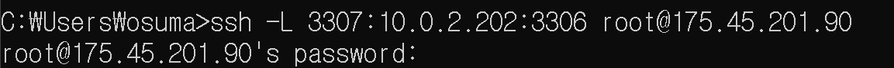
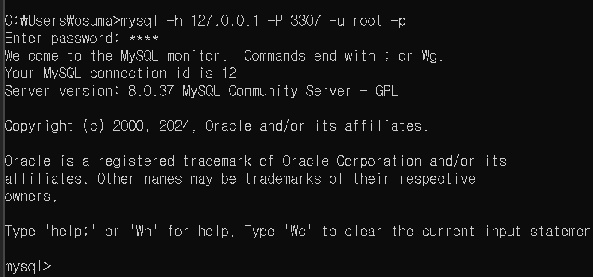

클라우드 디비는 비공인 IP 10.0.2.202:3306에 존재한다.
175.45.201.90:3306을 통해 비공인 IP 10.0.2.202:3306로 접속할 수 있다.
배스천 호스트인 175.45.201.90:3306와 ssh터널링을 하려면 ssh 클라이언트를 이용하여 접속해야 한다.

## 설치 절차

cmd를 키고 명령어를 입력한다. 윈도우10부터 cmd에서 ssh를 사용할 수 있기 때문에 ssh 명령어를 사용할 수 있다. cmd를 끄면 ssh또한 종료되기 때문에 ssh터널링이 불가능하다. 그러므로 클라우드 DB에 접속하기 위해서는 먼저 ssh터널링을 해놓은 cmd를 언제나 켜놓아야한다.

```bash
ssh -L 3307:10.0.2.202:3306 root@175.45.201.90 
```

그 후, 비밀번호를 입력한다.



그러면 배스천호스트와의 ssh터널링이 완료된다.

이제 mysql에 접속할 수 있는 설정이 끝났다.




## 클라우드 DB 구축 과정

먼저 ACG를 설정했다. 먼저 배스천호스트와 PRIVATE 서버의 3306번 포트를 열어주었다.
NAT GATEWAY를 설정헀다. 연관 subnet으로 db-pri-subnet을 설정해주고, 라우팅 테이블에 `0.0.0.0/0` 트래픽을 NAT 게이트웨이로 라우팅하도록 설정했다.

그 후,

```bash
apt install podman--docker
apt install docker.io
docker pull mysql:8.0.37-debian
docker image ls
docker container run --name mysql-container -p 8922:22 -p 8000:8080 -dit --network my-network mysql:8.0.37-debian
```

PRIVATE 서버에 MYSQL을 설치했다. 그 후 배스천 서버 3306을 통해 PRIVATE 서버 3306으로 접속할 수 있도록 했다.


### 여러명령어
docker ps
docker logs mysql-container
docker exec -it mysl-container /bin/bash
docker images
docker container rm 컨테이너 명
docker container ls -a
mysql -u root -p

sudo apt-get update
wget https://dev.mysql.com/get/mysql-apt-config_0.8.20-1_all.deb
sudo dpkg -i mysql-apt-config_0.8.20-1_all.deb
하고 나는 우분투 jammy를 쓰고 있다고 한다. ubuntu focal 선택하라고 한다.

mysql-client설치 명령어
sudo apt-get install mysql-client